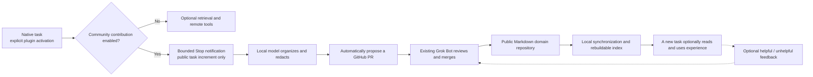

# MindIE Agent architecture

Current design, 2026-09-21. This replaces the earlier implementation plan from Issue #195; history remains in Git. The [nine inherited VAWS principles](design-principles.md) govern every adapter. [Implementation status](implementation-status.md) records evidence separately.

## Product and normal use

MindIE Agent enhances an existing Harness for NPU and infrastructure work. It does not supply its own foundation model, conversation harness, transcript hosting service or online knowledge API. Users work in their own business repositories and native tasks.

A user explicitly invokes the plugin in a task. The first use offers community contribution (recommended), read-only knowledge, or later configuration. Recommendation is not consent. The choice persists; routine turns do not repeat onboarding. General remote-dev tools work without activating knowledge.

Knowledge is optional reference material. Agents choose whether to query, read or give a thumbs-up/down after actual use. There is no mandatory retrieval, report, vote or model-driven closing ceremony.

The current domain is vLLM / vLLM-Ascend. A task uses its selected domain's knowledge and resources; additional domains retain independent content and indexes. Cross-domain assistance uses native tasks with bounded handoff when needed, without a mandatory router, global knowledge index or new conversation framework. Business source and native worktrees remain owned by the user and Harness.

## Repositories and ownership

| Component | Owns |
| --- | --- |
| This architecture repository | Product semantics, domain boundaries, design decisions and cross-adapter delivery status |
| Codex, Kimi and Claude Code adapter repositories | Native task identity, explicit entry, onboarding, Hook translation, public transcript parsing, native model invocation, plugin installation and update |
| Shared knowledge runtime | Admission, bounded increments, redaction and organization coordination, retrieval, optional feedback, publication receipts and cleanup |
| Public domain knowledge repository | Reviewed Markdown content, versions and distribution through GitHub |
| Existing Grok Bot application | Review proposed public content for sensitive or impermissible material and trigger appropriate merges, corrections or removal |
| remote-dev | Remote files, commands, jobs, cancellation and artifacts, independent of knowledge activation |
| coordinator and other existing tools | Their own bounded execution or diagnostic duties, only when the actual task needs them |

Adapters reuse the same knowledge and remote-dev implementations. Native identity and transcript formats stay in adapters. A shared runtime must not import a host-specific lease table or guess a task from the latest session or working directory. Adapter separation does not justify a second knowledge database or publishing protocol.

Grok Bot means the installed bot application, not Grok CLI. There is no routine-wide one-merge quota, arbitrary candidate count or mandatory twenty-minute review window.

## Contribution and reuse loop

When contribution is off, there is no Hook collection, redaction or organization model call, nor a capture archive. Read-only feed synchronization can still run.

When enabled, only the explicitly admitted native task and authorized project scope can contribute. Forks and new tasks have separate identities. Disable cancels unsent work; re-enable admits subsequent material, not an automatic replay of old history. Raw transcripts remain local and never become GitHub content.

The Hook only admits a bounded notification and exits normally. It must not require the business model to continue its turn. Parsing and model work happen outside the short Hook budget. Every operation has its own time/output boundary; failed model input is not automatically retried. Unknown publication results are reconciled against the original remote branch/PR before another write.

The local model makes a faithful public record of actual task actions and observations, retaining useful commands, parameters, recorded errors, outputs, public evidence and uncertainty. It does not have to summarize lessons, prescribe advice, identify a root cause or force a failure-fix-success story. Title and summary are neutral retrieval introductions; the detailed body carries the record. Details not mentioned in the source are omitted: do not infer a missing execution history and do not add an unknowns checklist. Preserve uncertainty when the source itself states it. Do not promote a reported result into a stronger verification claim. Corrections preserve the earlier and later observations without inventing causation. Internal reasoning, injected instructions, credentials and unrelated history are excluded.

Publishing uses the already prepared public body. Creating or updating the PR is mechanical and does not need another model rewriting pass. The existing Bot reviews content rather than manufacturing a second corpus-processing pipeline.

## Public records and lightweight local state

Public entries are ordinary Markdown. Keep a clear title, retrieval summary and the knowledge/experience distinction. Optional `conditions` holds relevant software versions or source commits; absent values are allowed. Device choices, shapes, seeds, tolerances and command details belong in the body.

Local ownership, session provenance, retry bookkeeping, authorization and receipts remain local. Do not expose internal producer IDs, empty source arrays or routine lifecycle fields as public content. An entry's identity must support reference and feedback, but its exact storage belongs to the knowledge component contract; changing a title is not a required lifecycle step.

A confirmed PR head/path/content receipt is sufficient to compact the submitted local body and capture material; do not wait for merge. Preserve newer unsent observations. Later additions restore the exact submitted public body on demand, preserving maintainer edits and avoiding a fresh duplicate. Keep a small per-entry receipt and continuation cue, not a local transcript warehouse.

Unknown write outcomes retain the minimum reconciliation material. A known failed write may be explicitly resubmitted without reorganizing the same input. Neither recovery nor plugin update resets the capture boundary or permits replay of failed model work.

Public Git caches and indexes are rebuildable. SQLite may provide small transactions/indexes; replacing it with an equally complex JSON database would not simplify the product.

## Feedback and maintenance

Thumbs-up/down is a loose, optional usefulness signal, not truth certification. Missing feedback is not a negative vote. A consumer can explain whether an entry helped or misled it; the producer's self-assessment is not independent reuse evidence.

Negative feedback gives an unhelpful entry an exit path. Maintenance can correct or remove it from the distributed corpus; Git retains normal history. No public `retired` record or empty retirement reason is required after removal.

Repeated useful experience may suggest a Skill, but automatic Skill extraction is a future capability requiring a concrete useful example. Do not prebuild confidence ladders, promotion thresholds, compulsory judging calls or a second evaluation service. Skills mainly explain capabilities and methods; knowledge stays advisory.

## Activation, execution and updates

Native task identity, authorization, an in-flight operation, an MCP connection and a remote job have different lifetimes. Explicit authorization persists until disabled, paused for a failure or changed in scope. It does not expire merely because time passes or the runtime directory changes.

Adapters track remote `main` commits now; release tracking is a later change. An update stages the complete adapter, Skills, Hooks and pinned runtime, verifies the selected native package and actually loaded resources, and atomically commits one generation. Every operation uses a coherent scripts/interpreter/configuration tuple.

Actual in-flight work blocks switching. An idle authorized task or an old unknown PR receipt does not. The runtime's idle decision and admission freeze must be atomic. The original task must still control its existing remote job after an update.

When switching requires stopping a live local knowledge service, the updater preserves that fact and restores service under the selected generation if valid explicit task authorization remains. Restoration binds the selected Harness profile and its existing model configuration; process readiness alone does not establish that later organization can use that model. It does not start a service that was absent before the update. Successful switches and rollback use the same bounded transaction; failure to restore is reported rather than concealed as success. Stop hooks remain short notifications and do not start a service or model. The existing updater status records a pending handoff before stopping; an interrupted process leaves an observable degraded state. Later checks do not treat that marker as authority to replay startup.

Keep necessary old entrypoints and rollback data while a host may still use them. Installed files, definitions loaded into a live task, and Hook trust are separate facts. A host-required trust review is never bypassed or silently granted by an updater.

Native identity binding must use verified host evidence. Missing metadata can be bridged by an exact one-shot native tool event binding, never by guessing from content, timestamps or the latest task. A remote tool's job `session_id` alias is not a native task credential.

Detailed lifecycle semantics are in [Harness boundaries and lifecycle](harness-boundary-and-lifecycle.md).

## Delivery and acceptance

Codex, Kimi and Claude Code have independent repositories and native acceptance. Codex model tests use gpt-5.6-luna / max. The user authorized Kimi K3 / max for Kimi native acceptance. Claude Code runs on the local configured model, which must be named accurately in evidence.

macOS is the active hardware environment. Windows is part of the intended first release, with real Windows hardware supplied by the user after the adapter changes merge into main. Windows acceptance is not a gate for merging the pre-release implementation. CI passing on Windows does not complete that acceptance.

Development checks, native installation, real Hook delivery, a real public PR/Bot merge, and usefulness in a new task are recorded separately. A registry success, connected MCP panel or old revision's evidence cannot stand for the final implementation.

The current work prioritizes the lifecycle and knowledge loop across these three adapters. Old business Skills, profiling analysis, automatic Skill extraction and further domain/Harness expansion remain deferred. Cross-domain work may reuse native tasks and existing tools when needed; there is no compulsory domain router or new conversation framework.

The old VAWS bootstrap, source/worktree manager and legacy installation path remain retired. This permission to rewrite product internals does not authorize deletion of unrelated user repositories, private material or running resources.
