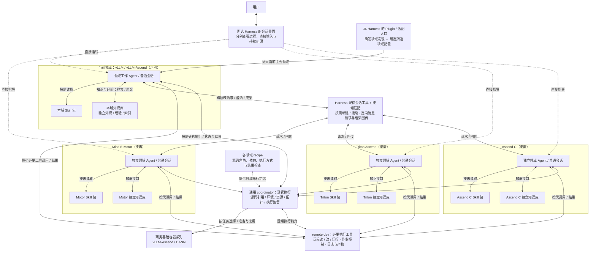
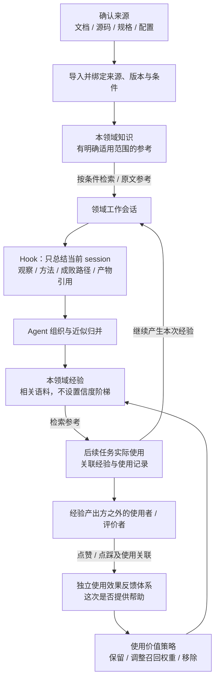
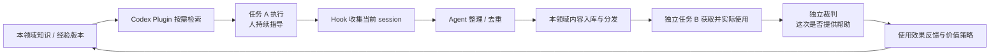

# MindIE Agent architecture

Architecture baseline from Issue #195, 2026-09-18. This describes the target design;
current implementation and acceptance limits are in the repository README.

## 1. 产品目标与使用方式

**通过准确的领域上下文、稳定工具，以及知识、经验和使用效果反馈的完整闭环，让当前会话复用其他会话已经付出过代价的上下文，更快完成实际任务。** 数据飞轮体现为语料积累、使用反馈与检索效果改善。

MindIE Agent 首发提供 Codex Plugin，首个业务领域仍为 **vLLM / vLLM-Ascend**；MindIE Motor 继续作为独立领域之一。用户在自己的业务仓库或 Harness 原生 worktree 中使用 Plugin；产品不再拥有业务源码，也不要求进入 VAWS checkout。单领域独立可用，例如修改 vLLM-Ascend 特性，无需启用 Motor 或算子领域。

- **一会话一个主要领域。** 当前会话承担实质工作，按需读取本领域 Skill 和语料；用户持续查看公开分析说明、工具、证据和代码变化，直接纠正方向。
- **跨域按需建立独立会话。** 新会话有自己的领域配置与上下文，用户可直接进入并持续对话；相关会话通过同一 Harness 协作。
- **只控制本产品新增的能力。** 简短介绍 Skill 可以作为发现入口，选定领域后装载其资源；用户已有的第三方 Skill、Plugin、MCP 与配置保持原样。
- **单领域即可完成积累闭环。** 当前 session 的经验通过 Hook 收集和归并；后续工作检索使用，由经验产出方之外的反馈方评价本次是否实际有帮助，反馈影响经验的检索权重和保留状态。

效率以完成真实任务的总成本衡量，包括用户引导、理解、等待、交接、重复调查／实验和返工。领域、Skill 或并发 Agent 数量本身不是目标。

## 2. 调用关系：域内工作，跨域协作

以下以 **vLLM-Ascend 为当前主要领域** 举例；实际主要领域随任务选择。Motor、Triton Ascend、Ascend C 会话仅在需要时创建或接续。

**读图要点：** 每个领域 Agent 调用自己的 Skill、独立知识库及必要工具；跨域请求经 Harness 会话能力送到另一个可直接交互的领域会话，结果回传后继续工作。用户可分别指导图中的每个会话。知识与经验接口由共享组件实现；受管任务经通用 coordinator 使用领域 recipe 和相应环境。经验使用效果由独立反馈体系记录，并作用于检索权重与保留状态，闭环见第 5 节。图中的会话工具是 Harness 能力及其适配入口。

### 会话与任务组织

| 情况 | 采用方式 |
| --- | --- |
| 当前领域内持续工作 | 接续原会话，沿用领域配置、证据与用户指导 |
| 需要另一领域持续承担调查或开发 | **New：新建独立领域会话**，或接续已关联的适用会话；交接必要目标、约束、证据及代码／环境引用 |
| 同领域探索另一条方案且需要继承历史 | 按需 **Fork**；明确其历史和能力继承范围 |
| 查一段邻域代码、确认一个接口等局部辅助工作 | 由当前会话按需要处理；可使用适合的辅助 Subagent |

一领域可以对应多个不同任务的会话；领域数不决定会话数或并发数。跨域工作以责任边界和持续能力需要判断，避免机械拆分造成重复调查和频繁切换。发起协作的领域会话继续承担本领域工作与业务成果集成，任务关联优先复用 Harness。

持续人机协作依赖用户直接进入工作会话。界面可以展示多个会话的公开过程，各模型只接收必要交接信息。原生 Fork 往往继承历史；刷新 Skill 目录或关闭配置不会清除已经进入历史的内容，因此跨域默认采用 New 加有限交接。

跨域请求发出后，发起方继续推进本域能够完成的部分。确实依赖对方且无法继续时，根据 Harness 可见状态说明原因与所需动作，例如需要打开目标会话或处理该端批准请求；状态不可见时如实说明，避免静默等待。沿用用户授予该任务的既有完整权限，本产品不新增跨域降权或独立授权层；消息保留来源，Harness 原有权限与批准机制仍按其实际语义生效。

## 3. 领域划分与上下文范围

初始按框架与算子开发体系组织，四个方向为：

| 类型 | 初始领域 | 主要内容举例 |
| --- | --- | --- |
| 框架 | vLLM / vLLM-Ascend | 模型适配、服务、graph、分布式、正确性与性能 |
| 框架 | MindIE Motor | 部署、调度、PD 编排、恢复与引擎联调 |
| 算子 | Triton Ascend | 开发／迁移、正确性、编译与性能优化 |
| 算子 | Ascend C | tiling、流水与同步、编译加载、正确性与性能优化 |

四类是起点，最终粒度按实际任务调整。**继续拆出独立领域必须同时满足：**

1. 当前领域 Skill 过多，且无法通过可用的加载／发现机制消除其负担。
2. 拆出的部分具有明确、可独立承担工作的领域边界。

领域粒度、项目内任务拆分、会话创建与复用一起设计，兼顾上下文成本、交接成本和用户切换成本。知识量增长需要内容组织与索引优化，本身不是机械拆域的充分条件。

**六端共同基线：较小领域 + 本域 Skill 目录可以可见 + 正文和参考资料按需读取。** 隐藏未选 Skill 描述、动态发现和热加载是各端可选优化。已有调研表明这些能力的作用域和限制不同，见附录 B；缺少描述隐藏能力不阻塞该基线。

每个领域包包含范围说明、Skill 资源、源码角色与 recipe、必要工具声明、独立知识／经验绑定及版本／适用范围。适配器负责让本产品的资源发现与注入按所选领域生效；领域尚不明确时可以先使用简短介绍入口。绑定时机与后续变更按各 Harness 的实际能力实现，不能只靠提示词要求忽略其他领域，也不能因切换一个会话而改变其他活动会话的配置。

### Skill、工具与语料的归属

边界明确的机械流程由工具承接；有来源、明确条件与版本约束的参考进入知识轨；任务观察、方法、教训、失败路径等进入经验轨，由后续使用效果判断其价值。Skill 提供领域概念、能力入口、基本用法、必要示例与检索线索，避免同一份内容多处维护。

工具化和语料沉淀可以使 Skill 变薄，但体积单调下降不作为硬性目标；保留冷启动所需信息，以总任务成本判断。经验不按内容形式或能否补齐版本设置排除规则。

## 4. 核心组件、运行环境与复用关系

**共享领域资产和组件实现，各 Harness 单独适配。** 各端可以建立独立适配仓库并独立发布，共同知识与业务方法按版本消费。

| 模块 | 核心职责 |
| --- | --- |
| 领域能力包 | 领域范围、Skill、源码角色、recipe、知识／经验绑定和必要工具声明 |
| Harness 适配包 / Plugin | 安装与发现、领域配置、Hook 接入、普通会话创建／接续、通信及界面导航 |
| Harness 本身 | 模型运行、会话历史、公开过程显示、用户输入、纠偏与会话消息机制 |
| **remote-dev** | 远程文件读改、命令与作业控制、日志和产物获取等稳定执行能力 |
| **通用 coordinator** | 受管执行：源码引用、环境准备与复用、资源／拓扑、服务与长作业监督、执行记录 |
| **知识与经验组件** | 知识导入与来源绑定、经验采集／归并、各域独立索引、检索、内容维护；接入独立反馈体系 |
| **独立使用效果反馈体系** | 关联经验、使用记录及第三方反馈；向排序和保留策略提供实际帮助程度的信号 |
| 维护与分发 | 领域包、版本和依赖、更新／回退、索引及语料发布 |
| 可选组件 | 场景需要的监控、诊断及既有平台集成 |

核心执行与语料组件明确为 **remote-dev、通用 coordinator、知识与经验组件**。反馈在语义、记录和接口上独立；是否单独部署或打包留到设计阶段，不由组件数量推导常驻 MCP 数量。工作会话按需获得必要工具，采集、归并、索引、发布等流程不全部暴露为每个 Agent 的日常工具。

### coordinator 泛化与两类基础容器

coordinator 的执行契约保持领域无关。领域特定的依赖、命令、配置与结果检查归入领域包的 recipe；源码由用户或会话提供绑定，coordinator 消费引用并完成执行所需准备，不接管用户仓库或原生 worktree 的生命周期。

初期容器按 **vLLM-Ascend、CANN 两个基础镜像系列** 组织，允许各自的版本与必要依赖扩展；CANN 系列沿其专用镜像来源选择，具体仓库、标签及兼容组合在执行设计中落实。领域数与容器类别数独立，多个领域可以复用同一类环境。

共享组件定义通用的来源、环境与执行记录，具体需要哪些软件、设备和拓扑信息由领域／recipe 声明，不把 vLLM 字段做成所有领域的必填项。相关背景优先复用实际执行时的记录，避免结束 Hook 读取已变化的当前环境后误标结果；这些背景不构成经验入库的版本门槛。

### Harness 与业务执行的职责

本地文件、Git、shell 与文档访问复用原生工具。跨会话消息、用户纠偏与接续使用 Harness 的现有机制和适配入口；coordinator 监督业务执行，不承担会话总调度。本产品不新增统一约束同步、独立授权或第二套聊天历史。

优先复用原生 GUI；界面或接口缺口在各端实现时 case by case 处理。共同体验要求每个领域会话可直接查看、持续纠正并能够协作。

## 5. 知识、经验与独立反馈闭环

### 5.1 两类语料，各自表达清楚

| | **知识** | **经验** |
| --- | --- | --- |
| 定位 | 有明确来源、强条件和版本限定的参考 | 与任务相关的历史观察、方法、教训、线索及产物引用 |
| 进入方式 | 显式导入，绑定来源与版本／环境条件 | Hook 总结当前 session，Agent 组织与归并后进入本领域经验库 |
| 版本与环境 | 明确记录，用于判断当前是否适用 | 有则保留为背景，不作强制匹配或收录门槛 |
| 置信度 | 通过来源和限定条件说明依据，不以投票认证事实 | 不设置信度阶梯或独立复现认证体系 |
| 使用方式 | 带来源与适用范围供 Agent 参考 | 作为相关语料帮助当前任务，由使用效果反馈决定价值 |
| 维护依据 | 来源更新、版本区分、冲突与修订 | 实际帮助程度影响召回权重与保留状态 |

**经验不承担事实认证职责，内容形式或“是否是真理”不构成永久保留或排除理由。** 有帮助就值得留下；即使内容正确，长期对实际任务没有帮助，也可以降低搜索权重或移除。版本、证据和背景帮助理解语料，不再转成经验的置信度升级要求。

知识与经验在检索结果中明确区分。知识按适用版本返回，当前环境不匹配不等于原知识在历史环境中错误；新版本不能无条件遮蔽仍适用于旧版本的内容。经验不强制经过版本过滤，由相关性与实际使用反馈等信号决定召回；具体排序方式后续设计。

### 5.2 反馈独立记录，并影响经验去留

反馈体系评价的是 **某条经验在一次实际使用中是否提供了帮助**。经验产出方之外的使用者／评价者提供反馈；评价方的具体接入方式后续明确，不把产出方的自述当作使用收益，也不要求用户每个任务手工评价。

分别保留三个对象：**经验本体、使用记录、第三方反馈**。通过引用关联，记录本次使用与正负反馈，供检索排序和保留策略使用。独立体系不等于必须新增独立服务。

- **正向反馈：** 帮助了判断、避免重复试错或减少操作／实验成本，支持保留并提高有用经验的召回机会。
- **负向反馈：** 没有提供帮助或产生负面效果，是可以降权与移除的强信号。持续或普遍负面时允许降低总体搜索权重、移出有效经验库，不能以内容正确为由永久保留。
- **无反馈：** 表示效果尚未被观察，不直接计为负面。

反馈的聚合范围、重复使用／重复反馈处理、时间窗口、降权与移除阈值，以及归档或物理清理方式留到组件设计。不预设固定的全局／情境权重公式；**也不再规定“点踩只补不适用条件、不减分、不触发移除”。**

### 5.3 两条内容路径与使用反馈

Hook 使用当前 session 的可用总结和过程，包含成功、失败、死胡同与有帮助的方法；用户无需另写报告。Agent 审查负责表达、来源关联与近似归并，不把经验当成待逐级认证的事实。引用已有条目时保留关联，避免同一内容反复生成副本；归并不意味着新增独立复现或置信度提升。

**知识组件不可用时，本次 Hook 候选直接丢弃，不建立本地持久化补偿队列或重试流程。** 故障不阻塞用户任务；失败／丢弃的轻量可观察方式在实现中落实，知识组件的可用性与检索可靠性纳入首轮实现。

任务完整历史继续由 Harness 管理；语料保留必要上下文及任务、实验与产物引用。实验索引用于发现已做过的工作、减少重复真机开销；产物失效如实标注，不据此给所有相关经验套用置信度降级。

### 5.4 独立领域库与渐进扩展

每个已建立的领域独立拥有内容、索引和反馈状态；同领域多个会话复用本领域库，六端共用组件实现。初期先以 **vLLM-Ascend** 为语料积累与发布入口，保持目录简单。内容增长后再增加二级目录或按第 3 节条件拆域；不提前建设完整的个人／项目／团队分层体系。

仓库与目录的组织可以调整，不等于把所有领域做成一个全域大索引。已有独立领域不强制合库；拆分后的索引与资源绑定各自独立，相关客户端通过绑定消费。来源明确的公共基础知识可以按版本共享引用，不重新引入默认全域检索。经验按当前领域组织，后续迁移随领域拆分处理。

语料内容沿用 Markdown／Git 管理，索引可重建；公共发布保留既有脱敏边界。共享组件定义通用结构，领域字段按实际需要扩展。知识图谱、复杂分发层次和额外检索结构按实际需要选择，不作为首轮前置依赖。

## 6. 核心效率要求：隔离与资源复用同时成立

**会话、语料索引、反馈记录、MCP 连接和远端作业分别管理生命周期。** 领域上下文与索引独立，兼容引擎、容器环境、构建和实验产物按需复用；会话创建、切换或结束不天然触发昂贵资源的重复准备或失效。

- 会话事实由 Harness 管理；语料与使用效果由相应组件管理；受管执行状态由 coordinator 管理，直接远端操作由 remote-dev 或既有平台承接。
- 业务源码归用户。受管执行消费明确源码引用，跨域交接保留任务相关的实际代码／环境与产物记录，方便结果集成和复用；这不赋予本产品管理用户 worktree 的职责。
- 工作会话只按需消费能力；安装、升级、索引重建、语料维护与发布在相应生命周期处理。活动任务的领域与版本应能稳定接续。
- 知识暂不可用时保留原生代码工作能力；可选服务失败不成为所有领域启动的共同前置条件。Hook 失败按第 5 节丢弃策略处理。

领域内容可见性、MCP 连接和进程故障影响分别设计与验证。资源复用不能靠让 Agent 手工编排工具内部管理步骤实现。

## 7. 客户端范围、回归检测与 VAWS 迁移

**目标态：Codex、Cursor、Kimi Code、Claude Code、DeepSeek Harness、Grok Build 六端达到完整体验；Z Code 暂缓。** **Codex 首发**，其他 Harness 后续基于稳定的领域包与组件合同适配；DSH 接受较多定制开发，其他端本轮不另排具体实施次序。各端只做同一 Harness 内的跨领域协作，不要求用户安装或订阅其他 Harness。

各适配器可采用受支持的 Plugin、CLI、Hook、SDK 或扩展接口，保持共同产品语义。领域装载、普通会话直接交互与通信必须在该端实际选择的同一使用路径成立；附录仍是机制证据，不能拼接不同入口的长处作为完整通过结论。

**适配回归以最新可用版本为基准，并在 macOS、Windows 各一台实装 CI 机器上做真实调用检测。** 六端实际版本与入口随结果记录，不能仅比对版本号。GUI 自动化边界与是否扩展 Linux 覆盖留到逐端检测设计；现阶段不将附录中的资料调查写成实测通过。

**VAWS 自有 submodule／worktree 组织与围绕其建立的源码准备机制退役，产品以 Plugin 提供领域能力。** 用户或 Harness 原生 worktree 继续使用。迁移包括固定相对源码路径、submodule 上下文假设及相关准备／pin 逻辑；领域包改为声明源码角色并绑定用户实际 checkout。

remote-dev、coordinator 和知识组件按新边界复用或重构，领域 Skill、语料与验证证据按价值迁移。coordinator 保留并泛化；top／diagnostics 等按场景选用。产品名称确定为 **MindIE Agent**。**采用破坏性变更，不保留或维护原版运行通道、legacy 分支、旧更新器兼容层或双轨安装方式。** 旧脚手架、接口和配置可按目标架构直接替换，新版采用新的安装与配置入口；正常 Git 历史和有价值的来源证据仍保留，不将其作为受支持旧版。既有用户业务源码、私有语料与运行中的资源不因取消兼容而自动清除。组织／仓库命名统一与非核心组件整理按实际交付需要安排。

## 8. Codex Plugin 首发计划

### 8.0 当前优先级：破坏性重构，核心闭环优先

2026-09-18 最新决定：**不留原版通道，优先实现 Plugin、知识库、收集、分发、裁判这一套基于 RSI 思路的闭环。** 取消此前迁移方案中的 legacy/vaws、旧更新器修复、自动升级兼容与双轨运行工作。

首轮以 **Codex + vLLM-Ascend 单领域** 贯通完整链路。仓库结构为这条链路提供清楚的归属；组织更名、八仓全面整理、monitor 改名及其他 Harness 适配不占据关键路径。remote-dev 和 coordinator 复用现有必要能力，其全面泛化随真实用例推进。

### 8.1 首轮交付内容与归属

| 部分 | 首轮必须做到 | 归属 |
| --- | --- | --- |
| **Codex Plugin** | 用户在自己的业务仓库使用；小入口 Skill、当前领域资源、必要工具、Hook；用户能持续指导当前任务 | Codex 适配仓 |
| **领域知识库** | 知识／经验区分；来源与原文可追溯；本领域独立存储、索引和检索 | 通用 knowledge 实现 + vLLM-Ascend 内容仓 |
| **经验收集** | Hook 使用当前 session 的可用总结、工具结果和产物引用；Agent 整理与去重；自动进入领域经验流程 | Plugin 采集适配 + knowledge 整理 |
| **分发复用** | 整理后的领域内容形成可识别版本；另一个独立任务／客户端实例能够获取并实际使用 | knowledge 分发 + 领域内容发布 |
| **独立裁判** | 根据后续实际使用证据评价这条经验是否有帮助；记录正／负／暂无法判断及理由；结果作用于检索权重和保留状态 | knowledge 内独立评价与反馈模块 |

Codex 适配仓为 mindie-agent/mindie-agent-codex；主仓负责架构与领域边界；knowledge 与领域内容分开。各端只消费对应领域；语料归并和裁判角色无需因此各建独立 MCP 或仓库。组织及组件仓库已完成改名，完整映射见主仓 README。

### 8.2 核心闭环与 RSI 在首版的落点

**首版将 RSI 思路落实为：任务产生经验，经验被其他任务使用，使用效果改变后续可获得的参考，从而有机会改善下一轮任务行为。** 收集量增加或裁判打分本身不等于实际改进；需要观察后续任务的成功情况、重复试错、耗时及人工纠偏成本。Skill／工具代码的自动改写不作为本次已承诺的能力，首轮改进对象为领域语料及其召回／保留策略。

区分两类处理：
- **入库整理 Agent：** 负责表达、来源关联、脱敏与近似归并，保留经验的上下文；不把经验变成需要置信度认证的事实。
- **使用效果裁判：** 读取经验、真实使用记录和可观察结果，评价帮助程度。经验生产会话的自述不能代替裁判；不得仅凭文笔、理论正确性或生产者自评加权。后续消费会话可提供反馈，独立评价任务如何运行在组件设计中确定。

有证据支持的正向反馈提升有用经验的召回机会；持续负向反馈可以降权或移除。缺少使用结果时记为无法判断，不能自动记为负面。评分可追溯到一次使用，避免一次使用反复反馈被计为多次独立受益；不增加经验的版本门槛或置信度体系。

### 8.3 实施顺序：先交付最小完整闭环，再扩展

| 阶段 | 交付 | 验收依据 |
| --- | --- | --- |
| **一：Codex 单领域闭环** | 在同一轮实现中贯通 Plugin、检索、收集、整理、发布、独立消费、裁判和权重回写；只接必要执行工具 | A 的经验经分发后被独立 B 获取并实际使用；评价结果真实改变后续 C 的检索／保留行为；另有无反馈与负向反馈路径 |
| **二：闭环效果与可靠性** | 在真实领域任务中反复使用；处理重复条目／反馈、版本切换和采集失败；检查裁判依据与闭环成本 | 能区分“链路通了”和“任务确实受益”；记录结果质量、重复工作、耗时与人工干预；没有证据时不宣称 RSI 收益 |
| **三：跨域与规模扩展** | Triton Ascend／CANN、可直接指导的独立领域任务、必要 coordinator 泛化、后续 Harness | 在各领域独立索引和上下文的前提下完成跨域协作；单领域闭环继续独立可用 |

第一阶段可以分小步开发，但五个核心环节共同构成第一份可用交付；不把收集、分发或裁判留作若干迭代后的附加功能。不要求先完成所有旧 Skill 迁移、四领域、六 Harness 或整个组织重命名。

### 8.4 首轮需要明确的最小接口与边界

- **领域与客户端绑定：** 当前领域、内容来源／版本、必要工具、普通任务入口与 Hook 生效方式；保留用户原有第三方扩展。
- **内容与使用关联：** 知识／经验标识及版本、当前 session 来源、实际使用记录、独立评价与反馈去重；字段以闭环所需为准。
- **收集与分发：** 当前 session 采集 → 整理入库 → 领域版本发布 → 其他客户端消费，沿用公共内容的脱敏边界。
- **裁判与回写：** 正负／无法判断及依据 → 排序和去留策略 → 下次检索生效。默认在主任务之外处理整理与评价，避免每一步工作都增加一次串行裁判调用。
- **复用已有工具：** 需要远端执行时接 remote-dev／coordinator；监控和诊断界面不成为启动闭环的前置条件。

领域隔离仍是产品约束。第一阶段接入时保留一个很小的异域样例，用来尽早发现领域目录／工具／知识绑定的作用域问题；真实双领域协作和完整领域迁移放在后续阶段。Plugin 打包、移动目录或 SDK 字段存在均不能代替实际使用路径验收。

Hook 只收集当前 session 可获得的内容，用户无需额外报告。知识组件不可用时丢弃该次 Hook 候选，不建立持久化补偿队列或阻塞工作；正常入库后的内容发布与同步属于知识组件自身生命周期。知识库、MCP 连接和远端资源独立管理与复用。

### 本次对早期评审草案的替代

- [双轨知识草案](https://github.com/mindie-agent/mindie-agent/issues/195#issuecomment-5687868447) 中的经验置信度阶梯、版本必填门槛、按内容类型排除经验、固定排序优先级、点踩不降权及永不自动移除规则，以本正文第 5 节的新语义替代。保留知识来源约束、两轨区分、近似归并与实验引用等方向。
- [评审收敛决定](https://github.com/mindie-agent/mindie-agent/issues/195#issuecomment-5688341104) 中已确认的 coordinator 泛化、Plugin 迁移、跨域权限沿用、Hook 丢弃、实装回归与非静默等待已并入正文；其待确认建议不自动成为要求。经验不设置信度后，dirty 置信度上限也不再适用。
- [Skill 边界补充](https://github.com/mindie-agent/mindie-agent/issues/195#issuecomment-5688569150) 的工具承接机械流程、Skill 保留触发与冷启动方向继续采用；经验的去留按实际帮助程度，Skill 体积不设单调下降硬约束。

### 本次命名与次序更新

2026-09-18 确认名称为 MindIE Agent、Codex 首发，取代此前的“名称待定”和“Cursor／Kimi 优先”；随后明确破坏性重构、不留原版通道，并将 Plugin／知识库／收集／分发／裁判的单领域闭环提升为首轮交付。此前“先完成组织与旧版迁移再做插件”及把知识反馈排在受管执行全面改造之后的次序，由本节替代。其他 Harness 的目标范围、领域边界及知识／经验／独立反馈语义继续采用正文定义。
