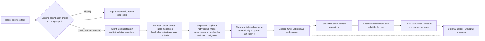

# MindIE Agent architecture

Current design, revised 2026-10-05. The [prerelease runtime contract](prerelease-runtime-design-2026-10-05.md) defines automatic task association, caller-owned execution limits and bounded growth. The [knowledge delivery and consumption contract](systematic-knowledge-design-2026-10-04.md) specifies the current Codex package, block-reading and citation semantics. This replaces the earlier implementation plan from Issue #195; history remains in Git. The [nine inherited VAWS principles](design-principles.md) govern every adapter. [Implementation status](implementation-status.md) records evidence separately; the simplifications below are requirements, not claims of completed acceptance.

The complete-material implementation and its earlier authorized synthetic native acceptance are recorded in [implementation status](implementation-status.md). Those results retain their exact revision boundaries and do not certify the new contracts or prerelease changes described here.

## Product and normal use

MindIE Agent enhances an existing Harness for NPU and infrastructure work. It does not supply its own foundation model, conversation harness, transcript hosting service or online knowledge API. Users work in their own business repositories and native tasks.

Installation establishes the existing contribution choice, public destination and project scope. Ordinary tasks use their native workflow. Verified native task identity, transcript ownership and current scope associate eligible work automatically; there is no daily activation command. Missing configuration, explicit disable and component failures remain distinct Agent-facing facts. General remote-dev tools and optional knowledge reads do not require a capture lease.

Knowledge is optional reference material. Agents choose whether to query, read or give a thumbs-up/down after actual use. There is no mandatory retrieval, report, vote or model-driven closing ceremony.

The current domain is vLLM / vLLM-Ascend. A task uses its selected domain's knowledge and resources; additional domains retain independent content and indexes. Cross-domain assistance uses native tasks with bounded handoff when needed, without a mandatory router, global knowledge index or new conversation framework. Business source and native worktrees remain owned by the user and Harness.

## Repositories and ownership

| Component | Owns |
| --- | --- |
| This architecture repository | Product semantics, domain boundaries, design decisions and cross-adapter delivery status |
| Codex, Kimi and Claude Code adapter repositories | Native task identity, explicit entry, onboarding, Hook translation, public transcript parsing, native model invocation, plugin installation and update |
| Shared knowledge runtime | Admission, bounded increments, redaction and organization coordination, retrieval, optional feedback, publication receipts and cleanup |
| Public domain knowledge repository | Reviewed Markdown content, versions and distribution through GitHub |
| Existing Grok Bot application | Review proposed public content for sensitive or impermissible material and trigger appropriate merges, corrections or removal |
| remote-dev | Remote files, commands, jobs, cancellation and artifacts, independent of knowledge activation |
| diagnostics | Bounded local logs, actionable fault references and independently authorized, finite GitHub Issue reporting; shared by all adapters |
| coordinator and other existing tools | Their own bounded execution or diagnostic duties, only when the actual task needs them |

Adapters reuse the same knowledge and remote-dev implementations. Native identity and transcript formats stay in adapters. A shared runtime must not import a host-specific lease table or guess a task from the latest session or working directory. Adapter separation does not justify a second knowledge database or publishing protocol.

Grok Bot means the installed bot application, not Grok CLI. There is no routine-wide one-merge quota, arbitrary candidate count or mandatory twenty-minute review window.

## Contribution and reuse loop

```mermaid
flowchart LR
    A["Native business task"] --> C{"Existing contribution choice and scope apply?"}
    C -->|Missing| R["Agent-only configuration diagnostic"]
    R --> C
    C -->|Configured and enabled| H["Silent Stop notification<br/>verified task increment only"]
    H --> L["Harness parser selects public messages<br/>local rules redact and save the body"]
L --> M["LangMem through the native small model<br/>index complete new blocks and short navigation"]
    M --> P["Complete indexed package<br/>automatically propose a GitHub PR"]
    P --> B["Existing Grok Bot reviews and merges"]
    B --> K["Public Markdown domain repository"]
    K --> S["Local synchronization and rebuildable index"]
    S --> N["A new task optionally reads and uses experience"]
    N -.-> F["Optional helpful / unhelpful feedback"]
    F -.-> B
```

Missing configuration, explicit disable, scope mismatch and a component fault are distinct states, not successful alternative product modes. Explicit disable and legacy declined settings stop new collection; migration must not silently enable them. Task binding alone never establishes that capture or contribution completed. Retrieval and remote tools remain independently usable.

When enabled, only the verified native task and existing authorized project scope can contribute. Forks and new tasks have separate identities. Disable cancels unsent work; re-enable admits subsequent material, not an automatic replay of old history. Raw transcripts remain local and never become GitHub content.

The Hook durably admits a notification and exits with neutral protocol output. It does not request another business-model turn or display MindIE operations messages. Pending failures reach the Agent through the next natural capability call, with bounded references rather than private content. Model work runs in the existing background owner. Healthy operations have no default total execution deadline; only caller-requested limits end business execution. Failed or uncertain model input is not automatically retried. Unknown publication results are reconciled against the original remote branch/PR before another write.

Task length, accumulated experience body size and total corpus size are not admission limits. Long tasks use incremental reads, saved progress and bounded model input/output; the component must continue through all admitted material without truncating the remainder or requiring a new user task. Bound memory and concurrency at the operation boundary; process/connection health and cancellation govern liveness. Elapsed time or silence does not establish failure. Internal processing chunks and submission coalescing are implementation details, not user-managed batches or fixed experience counts.

The body is the ordered, locally redacted public conversation. Codex implements
this first: user input, public assistant progress and final answers survive;
tool calls/results, hidden reasoning, injected instructions and native duplicate
wrappers do not. Compaction uses no model and does not shorten public messages.
Body and cursor commit together. Gitleaks plus explicit privacy rules run before
storage, model input or publication; repository review cannot undo a secret
uploaded in an earlier commit. Rule scanning cannot establish the publicness of
proprietary meaning, so existing project authorization remains necessary.

The complete mechanically redacted body is stored as immutable ordered blocks.
An adapter-owned model produces only each new block's fallible title/summary and
current task navigation, using prior navigation as context. It cannot rewrite
body bytes or replace the middle of a long task with a first/last excerpt.
Incremental indexing is required before public packaging. A failed index attempt
preserves local material and reports the unfinished stage; it is not a completed
publication. Returned model output survives local apply failures so recovery does
not repeat the model call. Publication, synchronization and retrieval invoke no
model. Codex supplies the current summary-worker protocol; Kimi and Claude Code
require independent worker integration and acceptance.

Live Stop intake and explicit historical import share the same projection,
redaction, incremental queue and package logic. History import requires an
explicitly selected source and reuses existing contribution scope; it does not
activate historical sessions or discover unrelated history. Consumers reuse
producer headers and build only local ReMe indexes, without another model call.
Claims remain attributed and uncertain. Other Harnesses require their own
adapter update and acceptance; this Codex implementation does not establish that evidence.

Publishing uses the already prepared public body. Creating or updating the PR is mechanical and does not need another model rewriting pass. The existing Bot reviews content rather than manufacturing a second corpus-processing pipeline.

## Public records and lightweight local state

Public material is a complete `tasks/<task_id>/` Markdown package: a
`mindie-material-task/1` manifest embeds a `mindie-entry/3` header and binds
ordered `mindie-material-block/1` files. A block's body is immutable under its
identity; replacing body text requires a new identity and updated manifest.
Keep a clear title, retrieval summary and the knowledge/experience distinction. Optional `conditions` holds relevant software versions or source commits; absent values are allowed. Device choices, shapes, seeds, tolerances and command details belong in the body.

Local ownership, session provenance, retry bookkeeping, authorization and receipts remain local. Do not expose internal producer IDs, empty source arrays or routine lifecycle fields as public content. An entry's identity must support reference and feedback, but its exact storage belongs to the knowledge component contract; changing a title is not a required lifecycle step.

A submission receipt records the exact PR head and complete package. Current
local material remains available until the confirmed public feed supplies that
revision; resolved frozen-send payloads can then be retired without another
publication. Later additions use the current valid feed package and append only
new admitted material. Independent remote changes are checked at the exact
head; conflicting packages require review and are never silently rewritten or
merged by a second model. Keep current authority files and necessary unresolved
send payloads, not a per-revision body archive. Withdrawn material is unavailable
and superseded fixed references expire explicitly.
Unknown write outcomes retain the minimum reconciliation material and are checked before another write. Known transient network and local staging failures resume quietly through the existing background worker with durable backoff and stable operation identities. Connection health and owner cancellation govern a live attempt; a healthy operation has no default execution deadline. A local export reservation is not a sent receipt and must not permanently consume material before an outbox exists. Neither recovery nor plugin update resets the capture boundary or permits replay of failed model work. Content rejection and deliberate remote removal are not transient failures: do not reopen or republish the rejected content automatically.

Contribution remains a persistent opt-in choice. Routine work needs no per-entry approval, discard decision or batch management. Confirmed submission cleanup and minimum duplicate-prevention receipts are internal responsibilities.

Markdown files are the body authority. SQLite holds small cursor, queue and outcome transactions; ReMe owns derived file/chunk/BM25 retrieval in the same process. Derived caches may contain material text and are rebuildable; no raw Harness transcript archive or second body database is introduced. LangMem is used as a function, without another graph store or background service.

Reading a task reference returns current navigation. Reading a block reference
returns exactly that current member block, its file hash and adjacent references.
An unchanged block remains readable after task append or metadata updates. Removal,
withdrawal and corrupt required files are distinct outcomes; readers never silently
substitute another version. Query and explain return a separate observed revision
reference for optional feedback. No historical-body archive is required.

Literal citations in block bodies support retrieval grouping only when the current
source body independently matches the query and covers the citing block's matched
terms. Groups expose the source and the strongest related observation's own excerpt
and block reference. Citation counts are not independent confirmations or authority.
Historical citations retain their literal identity; any current source is labeled
separately. Novel terms, multiple sources and unresolved citations stay discoverable.

## Feedback and maintenance

Thumbs-up/down is a loose, optional usefulness signal, not truth certification. Missing feedback is not a negative vote. A consumer can explain whether an entry helped or misled it; the producer's self-assessment is not independent reuse evidence.

Negative feedback gives an unhelpful entry an exit path. Maintenance can correct or remove it from the distributed corpus; Git retains normal history. No public `retired` record or empty retirement reason is required after removal.

Repeated useful experience may suggest a Skill, but automatic Skill extraction is a future capability requiring a concrete useful example. Do not prebuild confidence ladders, promotion thresholds, compulsory judging calls or a second evaluation service. Skills mainly explain capabilities and methods; knowledge stays advisory.

## Task association, execution and updates

Native task identity, authorization, an in-flight operation, an MCP connection and a remote job have different lifetimes. Explicit authorization persists until disabled or changed in scope. It does not expire merely because time passes or the runtime directory changes.

The immutable Codex adapter commit, its sole runtime dependency pins and its
`product-contract.json` identify one tested product combination. The public domain
repository declares schemas, exact validator and Bot review rules in
`publication-contract.json`. Setup, update, publication and feed intake verify the
exact declaration. Ordinary content updates under the same declaration need no
plugin release; a changed contract requires a matching combination. Intermediate
cross-repository deployment states fail visibly and retain prior valid state.
Runtime, content/Bot contract and adapter are published in that order; Git does not
provide a transaction across repositories.

The candidate's interpreter runs its own runtime validator. The running updater
checks source identity and a bounded receipt protocol without importing its own
version's private knowledge APIs. An update stages the complete adapter, Skills, Hooks and pinned runtime, verifies the selected native package and actually loaded resources, and atomically commits one generation. Every operation uses a coherent scripts/interpreter/configuration tuple.

Actual in-flight work blocks switching. An idle authorized task or an old unknown PR receipt does not. The runtime's idle decision and admission freeze must be atomic. The original task must still control its existing remote job after an update.

When switching requires stopping a live local knowledge service, the updater preserves that fact and restores service under the selected generation if valid explicit task authorization remains. Restoration binds the selected Harness profile and its existing model configuration; process readiness alone does not establish that later organization can use that model. A durable admitted Stop notification can request a bounded wake outside the Hook; it does not start a business turn or replay a missing event. Query and wake paths reconcile the actual endpoint and generation before starting one owned service. An interrupted handoff remains observable and may resume through these existing paths after rechecking authorization and process ownership; it must not require the user to discover a CLI command.

Plugin and feed updates classify failures. Temporary connectivity, rate limits and interrupted IO back off through the existing scheduler, honoring server retry guidance; three such failures must not permanently exclude an otherwise valid commit. Invalid content or incompatible generations remain isolated while the last working version stays available. Each attempt stays bounded; a later background network attempt is not another model attempt. Status records the last success, fault category and next recovery time. Authentication or native trust failures request the one necessary external action; routine connectivity failures do not wake the user or business model. Stable management entrypoints dispatch to the selected generation rather than an outdated installer copy.

Keep necessary old entrypoints and rollback data while a host may still use them. Installed files, definitions loaded into a live task, and Hook trust are separate facts. A host-required trust review is never bypassed or silently granted by an updater.

Native identity binding must use verified host evidence. Missing metadata can be bridged by an exact one-shot native tool event binding, never by guessing from content, timestamps or the latest task. A remote tool's job `session_id` alias is not a native task credential.

Detailed lifecycle semantics are in [Harness boundaries and lifecycle](harness-boundary-and-lifecycle.md).

## Diagnostics and fault reporting

Original component failures carry a local diagnostic reference and useful recovery facts. Logging has byte, count and age limits; offline maintenance protects live writers and every registered reader. Logging or reporting failure never changes the original business outcome or replays the operation.

Automatic tool-fault reporting is an independent optional user choice, separate from knowledge contribution. One shared reporter publishes only allowlisted code and execution facts, without transcripts, command arguments, raw output or model analysis. Expected caller, configuration, cancellation, connectivity and ordinary remote command failures do not automatically become product bug Issues. Stable fingerprints deduplicate across tasks; finite persisted processing budgets also cover readback and crashes. Unknown writes reconcile without automatic reposting.

The native adapters expose configuration and status; service installation runs outside short Hooks. They do not add a global all-task failure Hook or separate reporter per host. See [diagnostics and reporting](diagnostics-and-reporting.md) for the implementation contract and acceptance boundaries.

## Delivery and acceptance

Codex, Kimi and Claude Code have independent repositories and native acceptance. Current Codex business tests use gpt-6-luna / max in Windows PowerShell and WSL. This business setting never selects metadata effort: Codex body capture calls no model, and incremental index generation uses the adapter's internal model policy, with no separate user model configuration. Earlier metadata calls on both platforms do not establish acceptance of the new incremental package protocol. Kimi model acceptance is currently deferred; Claude Code's configured model must be named accurately in its own evidence.

Windows hardware is available for current PowerShell and WSL acceptance. Earlier macOS evidence remains scoped to its recorded versions and behavior. Windows CI does not prove native Stop delivery, actual NPU execution or public contribution: those boundaries require the controlled native run.

Development checks, native installation, real Hook delivery, a real public PR/Bot merge, and usefulness in a new task are recorded separately. A registry success, connected MCP panel or old revision's evidence cannot stand for the final implementation.

The current work prioritizes the lifecycle and knowledge loop across these three adapters. Old business Skills, profiling analysis, automatic Skill extraction and further domain/Harness expansion remain deferred. Cross-domain work may reuse native tasks and existing tools when needed; there is no compulsory domain router or new conversation framework.

The old VAWS bootstrap, source/worktree manager and legacy installation path remain retired. This permission to rewrite product internals does not authorize deletion of unrelated user repositories, private material or running resources.

Stable installation-level launchers select the current scripts under the switch lock and hold an OS generation lease until process exit. Generation cleanup retains the current config pointer, committed state, candidate, unresolved transaction and every leased generation. Missing or inconsistent state fails cleanup; untracked old paths are reported and preserved. Cleanup errors remain separate from already completed installation or business results.
