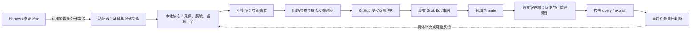

# MindIE 经验组件：流程、职责与交付合同

日期：2026-10-04。状态：完整设计建议，供实现与验收；不表示已安装或已通过真实闭环。

实施合同附件。主入口是[Transcript复用模块宏观架构](transcript-reuse-architecture-2026-10-04.md)，按用户最后要求确定组合与数据流；本文描述行为要求，不固定其必须由原有代码承担，与主文档冲突时以主文档为准。其他材料：[初始实现快照审查](knowledge-experience-review-2026-10-04.md)、[框架选型](knowledge-framework-selection-2026-10-04.md)、[测试与评估合同](knowledge-experience-evaluation-2026-10-04.md)。

本文形成于最初的只读研究阶段：该阶段只审查代码、运行合成故障实验并新增设计材料，没有调用真实摘要模型或对外提交经验。后续实现和真实材料验收已单独记录在[实施证据与原则审查](knowledge-review-2026-10-04/evidence/implementation-review.md)；不能把初始研究阶段的“未执行”范围套用到整个任务，也不能把本文的行为要求直接当成已通过的验收。

## 1. 核心目的与需求优先级

**用很少的额外工作和可见的成本，让一个任务已经产生的经历，成为另一个任务找得到、读得懂、能自行判断是否适用的参考。**

这里的“正确”指采集、归属、摘要、分享和读取没有扭曲经历，也没有隐藏处理失败。它不要求经历中的技术判断总是正确。猜测、失败、误判、未完成和后续撤回都可以有价值。

本设计按以下顺序解释需求：用户在当前讨论及指定历史讨论中的最新明确说明；当前九条设计原则；旧设计中仍不冲突的部分；实现。不能因某段实现已经存在，就把它反推成用户要求。

已确认的约束：

1. 不运营集中 transcript 存储、查询服务或模型集群。用户已有 Harness 持有原始记录；用户侧承担轻量处理，GitHub 承载公开经验与分发。
2. 用户侧可用 Luna 这类小模型生成检索摘要。不能未经比较就断言小模型不行，也不能把机械摘录声称为模型整理完成。
3. 不默认强模型重写全部正文、逐条验证技术结论、多角色反思或整理后再全量合并一次。
4. 本地只保留当前有效正文与完成操作所需的最小状态，不保留每轮全文历史，不建设另一份原始 transcript 档案。
5. 首次安装使用时持久保存授权选择；具体 session 仍需显式激活。普通重启、升级与恢复不能重新询问同一授权。安装级更新和公共语料同步获准独立运行，不读取未激活会话。
6. 历史导入只在用户明确要求贡献选定历史时触发。查看历史以理解需求，不等于导入、整理或发布历史。
7. 必要步骤失败必须可见。摘要缺失不能偷偷变成摘录完成；发布结果未知不能当作未发送再写一次。
8. 反馈、进一步整理为 Skill 和独立效果评估各有用途；不要求普通任务必查、必写、必投票或填写验收报告。

需求依据是本机可访问的《调研长程任务经验管理方案》（`01a0f2cf-2c63-7ab3-9195-546acf5767b2`）、《清理 VAWS 并分析性能》（`01a0edfc-9ddd-7512-bbfb-d40c39b5c854`）及当前请求。早期“全部新增材料逐批提炼可靠经验”的方案被后续低成本约束修正，不作为默认管线。旧文档中的运行时 judge、必填环境指纹、永久旧正文引用、固定 64 KiB 正文上限也不自动恢复。

## 2. 如何判断组件有用

一次完整交付需要同时回答：

| 问题 | 应提供的证据 |
| --- | --- |
| 用户是否轻松使用？ | 一次安装选择、显式 session 激活后正常工作；不额外经营内部状态；失败能直接定位到阶段 |
| 经历有没有变样？ | 保存允许的来源、时间顺序、说话者、失败和更正；不把助手计划改成实际执行，不把局部测试改成实机通过 |
| 别人找不找得到？ | 实际检索接口的命中和排序；仅看检索卡是否能判断相关；详情里能找到关键条件 |
| 花费是否合算？ | 采集、扫描、摘要、上传、Git、下载、索引和消费者阅读的成本，而非只有摘要请求字节 |
| 流程是否真的闭合？ | 原生事件、用户侧摘要、PR、Grok 对指定 head 的处理、main、独立客户端同步及读取，分别有证据 |
| 后续能否改善？ | 固定失败样例、可替换的内部摘要策略、同一评测合同、清楚的版本与回退边界 |

总成本按用户、维护者和消费者分别记账。把计算移给用户、把存储移给 GitHub，是费用承担方改变；重复上传、克隆和阅读仍是产品成本。GitHub 自身也有仓库健康和文件限制，不能把经验仓当无上限备份服务。[GitHub 官方说明](https://docs.github.com/en/repositories/working-with-files/managing-large-files/about-large-files-on-github)

## 3. 用户看到的流程

### 普通工作

1. 用户在业务会话显式使用 MindIE。读取安装级授权，绑定当前任务和领域；已授权者直接使用，不再逐次确认。
2. 查询公共经验始终按需。关闭贡献仍可查询和接收公共更新；不读取该任务记录、不生成候选、不调用整理模型、不上传。
3. 开启贡献且范围匹配时，Hook 只交接轻量事件。业务回复正常结束，后台处理不要求原 Agent 再回复一次。
4. 后台持久接收事件，增量读取允许内容，形成当前经验材料。先显示“材料已保存，摘要待处理”，不能显示“贡献完成”。
5. 合并一段正常工作产生的新材料后，小模型生成或更新检索头部。出站检查通过，自动创建或更新当前受控 PR；普通用户不用手工搬文件。
6. Grok 检查公开范围、恶意内容、格式和引用，按维护者现有授权决定合并。它不认证技术正确性，不默认运行经验中的命令。
7. 独立消费者同步已发布提交，在自己的本地索引中检索，按需展开正文，自行判断。纠正和失败观察可以成为后续贡献。

状态应是一句能行动的说明，例如：“材料已保存；摘要模型调用失败；尚未发布；修复配置后可从摘要阶段重试。”详细回执按需展开。

### 历史贡献

显式选择来源后，冻结选择范围与边界，走与普通采集相同的脱敏、摘要、出站路径。重复导入应识别相同材料；如果上次摘要失败，这次明确的重试意图应允许重试该阶段，不能只返回 unchanged 而永久卡住。没有重新授权的历史范围不随一次导入自动扩大。

### 停用与恢复

停用贡献立即阻止新的读取、模型调用和出站写入，取消未开始工作；已在执行的外部操作可能已经生效，必须记录已完成或结果未知。保留当前有效草稿，恢复不回填停用期间记录、不重置失败账目。用户可清理自己的本地草稿；公共内容的撤回走仓库流程。

## 4. 职责边界



| 层 | 负责 | 不承担 |
| --- | --- | --- |
| Harness 适配器 | 任务身份、显式激活、获准公开字段、版本适配、已有模型执行通道 | 共享知识业务状态机、技术真伪判决 |
| knowledge 核心 | 原子采集、当前材料、摘要调度、成本回执、发布状态、同步、检索 | 第二个 Harness、远端作业执行、集中模型服务 |
| 可替换的内部摘要实现 | 在规定输入和预算内返回标题、摘要及使用量 | 文件写入、shell、网络浏览、GitHub 权限、隐式采集其他任务 |
| 领域内容仓 | 普通 Markdown、条目身份、公开修正和删除、可信内容校验 | 私有运行库、原始会话仓库、用户身份凭据 |
| Grok Bot | 既有内容审阅与合并，针对新增反馈的有界维护 | 客户端所有原始记录的重加工、每次使用强制裁判 |

普通业务 Agent 保持现有 query、explain 和可选 feedback 三个能力。状态、历史导入、阶段重试继续使用安装/管理入口；不把每个内部状态设计成新的 MCP 工具。

## 5. 数据：正文、检索头部、操作回执

### 经验正文

正文是已经产生的、允许共享的经历材料。默认复用现有公开叙述和必要技术片段，不要求另一模型重写为规范案例。保留说话者归属、顺序、观察条件、失败、猜测、撤回及未完成结果。正文里的误判可以保留；加工过程制造误判不可接受。

“公开助手消息”仅说明对用户可见，不等于可以公开到 GitHub。原生 reasoning、系统/开发者消息、凭据、未经授权的其他任务始终不进入候选。默认不扩大到全部工具输出；确有价值的执行证据通过明确字段白名单另行评估，不能因助手提到测试通过而声称存在工具级证据。

先以当前稳定 entry_id 和任务材料归属为基础，不按每个 Stop 创建新经验。一个任务有多个问题时，标题/摘要允许多主题，不强行推断共同根因；后续需要拆分时由明确的内容修订完成。避免为了自动判断所有“经验边界”引入另一组模型。

只机械消除确定的重复事件、重复继承内容和宿主可识别的无信息包装。不同位置的同一错误可能是两次失败，不能仅凭字符串相同删除。自由文本的“仍在检查，不过已排除 X”不能当等待噪声丢掉。批量压缩普通进度或缩小正文采集范围，必须先通过信息保留评估，不能暗中改变完整性合同。

### 检索头部

当前任务包的 `mindie-material-task/1` manifest 嵌入 `mindie-entry/3` 头部：schema、entry_id、domain、kind、title、summary、conditions，以及绑定完整材料的 material_digest 和 revision。conditions 仅填已知且有关的版本/commit。块使用 `mindie-material-block/1`；有序块描述和导航共同参与完整性校验，不能把头部单独当作可发布正文。硬件、拓扑、参数、失败和适用边界放正文，不为了填字段额外探测用户环境。

小模型的工作是帮助读者判断“这条材料是否相关”。它可以生成粗略摘要，但不能把猜测改为结论、把计划改为执行、把失败改为成功。允许说“记录讨论了 A，并未确认修复”。不要求每条都有最终根因、复现脚本或成功标签。

关键词优先复用正文和摘要中的术语，不先增加第二套公开关键词格式。需要词汇规范化或别名时，先测实际检索缺口。摘要的输入覆盖范围可以放在当前 summary 提示中，详细区段留本地回执；覆盖说明不是对遗漏的质量豁免。

### 私有回执

最小状态包括：授权范围/代次、来源身份与字节边界、当前正文 digest、当前摘要所绑定的正文和策略版本、已开始的调用阶段/结果、累计用量、发布 operation ID/目标/head/回执、清理状态。

只保留能防止重复收费、重复发送、误归属和假成功的状态。回执不得包含原始私有正文、凭据或模型原始事件流。缓存是可删除的派生物；坏缓存报错或重建必须说明发生了什么，不能用旧内容冒充本次完成。

## 6. 长任务与小模型摘要

### 已确定的默认方向

保留小模型摘要能力，宏观主线选择完整新增批次与有界当前导航，避免中段永久不可见；真实质量和预算仍需固定评测。当前12KiB首尾保留为比较基线，不是默认生产方向。“小模型质量不好”和“关键材料没有进模型”需要分别诊断。

短材料可在一个受支持请求中完成一次全文摘要。长材料比较四条路径：全文一次小模型基线、现有首尾、结构化抽样、小模型增量更新。超出模型实际窗口的全文组如实记不可执行，不换大模型或截断后冒称全文基线。

结构化抽样作为成本比较组：在相同总输入预算内保留完整消息，覆盖开头、结尾和分布于中间的位置；用户更正、现象、失败与验证描述可以提高被选概率，但词汇规则不能被当作完整识别。去掉重复选段后恢复原顺序，保留前后归属。选段仅影响摘要输入，不未经说明删正文。

默认小模型增量摘要：每批新增材料加有界的当前检索头，直接得到新的可用头部，不再强制一轮最终全量重写。各材料块仍有独立入口与正文，当前任务导航不是唯一存档。必须测后期撤回能否更正早期摘要、长期主题是否被遗忘，以及多次调用开销；若默认方案验收不过，应调整摘要部件并说明依据，不伪称已通过。

消费者真正关心的是查得到和选得对。当前实现对标题、摘要和完整正文建立索引；摘要漏词不必然导致全文检索失败。应优先同时返回有界的正文命中片段，降低好正文被差摘要掩盖的影响。片段是来源摘录，明确标识，不冒充新的模型摘要，也不替代必需的摘要完成状态。

### 调度与成本合同

- 新增有效材料才产生待处理工作；合并短时间内通知，静默窗口是调度参数，不等于任务结束。
- 模型结果复用键绑定实际输入、策略、真实提示词/worker 版本、模型标识/配置及授权范围；应用回执绑定当前正文版本和重新核对的覆盖范围。未选区段变化而实际摘要输入相同，可以明确复用旧结果，不谎称新调用或全文覆盖。不能仅凭可执行文件路径没变就复用。
- 记每次调用的输入、缓存输入、输出、可得的推理用量、时延和状态，失败也记。计费数据缺失为 unknown，不是 0；输入字节不是 token 或价格。
- 摘要服务不拥有生产业务工具。材料中的命令和“忽略此前要求”等文本均为数据。
- 所有模型调用受已选择的总预算及单次期限约束。预算不足时保留已完成部分并说明未处理范围；不自动升级模型、追加反思或静默换摘录。
- 字节、token、输出、进程时限、正文体积、IPC 分页各属于不同限制；参数必须说明来源、超限行为与调节办法。平台 100 MiB 文件限制不能被解释成客户端已支持 100 MiB 常规处理。

## 7. 隐私与共享范围必须独立成立

现有 Gitleaks/规则扫描可复用，负责已定义的凭据、路径和身份模式；它不证明专有业务叙述已经可公开。小模型检索摘要也不天然等于语义脱敏。

第一版沿用已持久保存的共享范围和现有脱敏规则，已知不属于范围或命中未解决风险的材料阻止出站。不增加逐条人工审批；也不能把安装时开启共享解释为所有可见对话天然公开。状态和文档必须如实说明已检查的内容类别与规则能力边界。

混合私有材料的自动语义脱敏属于尚未承诺的扩展，**不作为默认闭环新增的模型前置步骤**。如果之后明确选择这项能力，应单独评估小模型同时做局部隐私标注与摘要的效果和费用；不要求技术验证或正文文风重写。该能力必须覆盖其声称已检查的拟出站材料，只读首尾不能为中段声称语义检查通过。不能既省略这项处理，又把现有规则扫描宣传成全面语义隐私审核。

语义模型也不能保证零泄露。已知不满足范围或检查失败应阻止出站，给出可定位状态；不把责任拖到公共 PR 创建后的 Grok 审查。公共 PR 已经是外发，Git 删除也不能从其他人的 clone/fork 撤回副本。[GitHub 官方说明](https://docs.github.com/en/authentication/keeping-your-account-and-data-secure/removing-sensitive-data-from-a-repository)

跨消息、跨页、跨通知的敏感区段需要轻量扫描状态或未闭合边界缓冲。不能独立扫描每段后就宣称整段安全。脱敏器和最终验证器必须共享受信占位符语法；原始来源自行伪造的占位符不能获得跳检特权。

## 8. 状态、失败和阶段重试

不用一个 success 覆盖全部流程。下表是内部操作合同，用户界面只显示相关阶段和下一步。

| 阶段 | 成功的含义 | 失败或未知时 |
| --- | --- | --- |
| 接收通知 | 当前获准事件已持久交接 | 交接未成功可明确重投同 event ID；协议正常退出不冒充业务成功 |
| 采集 | 当前正文、来源边界、继续读取标记同事务提交 | 读取/解析/脱敏失败不推进为已保存；坏格式与正常无新增不同 |
| 摘要准备 | 当前输入及处理版本确定，调用意图已记录 | 未开始模型可在明确的环境恢复后继续，无需重新采集 |
| 摘要调用 | 返回已取得并暂存必要结果与用量 | 超时/崩溃无法确认结果时记 unknown，不把 running 直接重置为未调用 |
| 摘要应用 | 输出检查通过，与当前 body digest 用 CAS 同时提交 | 本地扫描失败只重做本地扫描；正文变化则结果不覆盖新正文 |
| 出站准备 | 当前正文/摘要/范围检查均匹配，冻结本次操作内容 | 等待摘要需可见；不能静默过滤成“没有新贡献” |
| 外部发布 | 分支/PR 的实际回读与预期内容一致 | unknown 先核对同操作；明确失败允许显式阶段重试，不自动换 ID 重发 |
| 公开发布 | 指定 PR head 被处理并进入确定 main 提交 | opened、reviewed、merged 分开，Grok 未处理有明确状态 |
| 客户端同步 | 确定版本内容和索引完成原子切换 | 可继续读旧缓存，但同时显示更新失败/陈旧状态；空缓存失败不能报无匹配 |
| 清理 | 待删副本确实不存在 | 保留发布成功，另报清理失败，后续只清理不重复发布 |

只需新增或修正一个内部“从失败阶段继续”的语义，复用管理入口。输入为已有 operation/entry 范围及显式重试意图；仍校验授权、当前版本、未知外部结果和预算。不需要用户了解数据库表，不需要手改正文触发新摘要。

对于可确定未发生的局部机械失败，允许有限恢复；对于可能已经调用模型/写入 GitHub 的操作，先使用回执确定发生了什么。禁止无界重试，也禁止把“没有自动重试”实现成任何正常恢复都永久不可能。

模型通道若支持取回同一request结果则复用；不支持查询时保留该次可能消费的用量和unknown记录，允许显式请求一次新的摘要尝试，不能要求证明一个本来不可查询的事实才恢复。新的尝试不得重置旧账。GitHub未知写仍须先核对受控分支/PR，不能用新的操作ID掩盖未决写入。

远端任务包发生独立变化时，发布侧按每个文件的精确基线检查；基线不一致就保留当前候选并报告 `needs_review`，不自动把本地补充合入远端包，也不另调模型重建正文。正常续写只在当前有效包上追加已获准的新观察；必要的块入口和导航仍按既有增量索引合同处理。仅改 digest 不能使旧索引变成已校验的新索引。

## 9. 存储与资源生命周期

| 数据 | 保存原则 | 何时回收 |
| --- | --- | --- |
| 原始 transcript | 留在原 Harness；本组件只读选定范围 | 遵守 Harness 原有管理，本组件不操作其历史 |
| 本地经验 | 每个逻辑条目的当前有效正文；当前私有补充不得冒充已发布正文 | 新正文事务完成后移除旧正文；停用不擅自删除用户成果 |
| 摘要 | 当前有效头部及必要覆盖/版本回执 | 更新后替换；保留一次已返回但待本地检查的结果以免重新收费 |
| 待发送内容 | 一次已开始或结果未知操作所需的冻结内容 | 确认操作后只清理冗余副本；唯一当前候选按下表保留；未开始的旧候选可被新候选替代 |
| 发布缓存 | 当前公开正文与可重建索引 | 原子切换后删除旧缓存；不保存每轮全文或完整 Git 历史 |
| 日志与操作元数据 | 不含正文的有限诊断/去重信息 | 按实际故障定位需要设保留策略，统计实际总量 |

“只保留当前”不等于在 PR 一提交就删掉唯一可用的正文。公开主线未到达前仍需要当前待发布结果；它不是每一轮历史归档。已发布正文与未发布补充确实不同，显示和处理时要区分，不能算成两条独立证据。

允许暂时共存的是当前公开版本、当前未合并候选/补充，以及结果未知操作的必要冻结版本，不是历次正文归档：

| 状态 | 保留和清理 |
| --- | --- |
| PR已打开 | 保留当前候选可读；只清冗余暂存，不清唯一正文 |
| PR已合并但尚未同步 | 保留当前候选；等待确定main内容到达，不制造检索空窗 |
| main已同步 | 采用最终公开正文；清已合入候选/冻结副本；未发的新观察继续保留 |
| PR关闭未合并 | 候选仍是未发布材料；说明拒绝/关闭，用户删除或显式新贡献前不丢弃 |
| Bot改稿且本地有补充 | 远端当前包保持权威；候选精确基线不一致则报告 needs_review，由明确修订解决，不自动合并或恢复旧正文 |
| 用户删除草稿 | 删除自己的当前候选，保留处理未知写所需最小回执；公共内容不随本地删除 |

固定 revision 引用永不悄悄读到新正文。旧正文被回收时，explain 返回引用已过期，并提供重新查询当前条目的方法；退役返回已退役。放弃“旧引用永远可展开”的承诺，换取不保存旧正文；不构造伪历史、不因普通读取暗中下载旧 Git 历史。

组件管理的消费者缓存使用确定 main 提交的当前树，不替用户改动开发 checkout。浅 clone 只减少历史，不能消除当前语料大小；可用当前树下载或独立浅缓存，但必须保留提交校验、原子切换和明确同步错误。[Git 官方 clone 文档](https://git-scm.com/docs/git-clone)

GitHub 的正常提交历史是公开仓库既有机制。本地“只留最新”不要求自动重写公共 Git 历史；两者不同。公开仓库不断增长仍需计量与维护，不能以本地数据库已经缩小证明整个系统储存轻量。

增量读取也不等于增量成本。当前累计正文哈希、序列化和全文索引可能每次都重做。先测处理量和锁占用；优先合并更新、摘要只重建变化的索引字段、缩短事务；出现实测瓶颈再实现块级当前正文/索引。块可用于表达当前文档，不为保留每轮历史而引入事件溯源系统。

## 10. GitHub、Grok 与更新

保留现有受控暂存、分支、PR 更新、未知写回查和主线权威逻辑。每个出站修订记录 operation ID、目标 repo、基线、预期 head、实际 head 与 PR；任何恢复先处理未决旧操作。已打开 PR 更新原 PR；已合并后有新材料才产生后续 PR。Bot 改过的正文不能被本地旧全文覆盖。

客户端出站前检查条目、PR 标题/正文、提交消息和附件。内容贡献仅允许规定数据路径；经验中的 shell、URL、指令不能改变 Bot 策略、工作流或执行代码。可信校验器固定在已核实版本，内容 PR 自带的脚本不能成为自己的批准依据。

Grok 的普通 PR 审查与周期维护分开：前者主要检查可公开性、恶意内容、格式和引用，允许错误经验；后者基于新反例或反馈修正、关联、去重或提出 Skill。未改变的 head 复用已完成审阅，CI 稍后结束不再全文审一次；修改后需绑定新 head。技术意见相左不自动删记录，语义相似不自动合并不同条件的失败。

采用现有 Bot，不再自建常驻维护 Agent。真实事件触发与定时补查分别验收；定时补查成功不能证明 opened 事件已经送达。Bot 故障不能让本地显示“已合并”。

插件、knowledge 包、内容 schema/可信 validator 和策略版本形成明确安装组合。新候选测试成功后仍需更新依赖锁、安装回执、宿主信任/新任务验证；正在使用的会话不热替换实现。回退只切换兼容代码，不撤销已经确认的外部写、不复活退役内容，不重新询问已保存授权。

## 11. 消费与反馈

query 返回短卡：标题、摘要、命中片段、条件、来源类别和当前固定引用。正文分页用现有 explain，标记页范围；缺页、失效引用、索引未就绪和无匹配分别返回。语义相关分数不是事实可靠度。

来源不完整时保持真实边界：仅有助手自述就标为自述；本地路径不能成为外部消费者可用的证据链接。关键公开技术信息应尽量在正文自足，外链用于补充；链接失效可报告，但不自动补造或重跑实验。

反馈沿用当前每根任务、每条目修订一张可更改的票，理由可省略；具体更正优先成为带条件的内容修订。不把未投票、没采用或查询曝光当负评，不从低样本票数自动决定知识真伪。原 revision 的反馈不继承给修订后正文。

独立消费者测试是研发验收方法，不是生产每次使用新增一个裁判。Skill 整理走单独插件开发 PR，不把普通经验贡献自动升级成用户必须遵循的工作流。

## 12. 可集成性与实现范围

框架采用必须减少总维护量，保持 GitHub/Markdown 内容可迁移、用户侧运行、必要错误可见。详见[框架选型](knowledge-framework-selection-2026-10-04.md)。允许整合现成模块，但每个替换都要明确删掉了我们哪段代码、引入了哪些依赖，不能两套权威状态并存。

保留的是产品合同，不预先保护现有数据库或状态机。外部框架若能整体接管采集、队列或当前材料存储，并让我们删除更多维护代码，也应参加比较。授权、正文身份、发布回执与出站规则无论由哪种实现承担都必须成立，最终只留一份权威状态。

本次调研最小可试接点是“输入选择/小模型摘要”和“派生检索索引”，因为这两处有现成函数或文件接口，不意味着其他实现永远不能替换。第一轮不为未来所有框架建设通用插件注册表；选择一项后只实现相应内部接口，用固定fixture比较。比较旧实现修复和长期维护成本，与集成、迁移及长期维护成本，而非只数新依赖。

```text
SummaryRequest = approved material + current header if needed
               + coverage + body_digest + policy/model version + budget
SummaryResult  = title + summary + coverage + usage + actual model identity
               + completed/failed/unknown + safe error + request/attempt identity
```

这是跨内部实现的合同示意，不是让业务 Agent 手工填写的新 API。来源正文只能由确定的材料处理路径修改；摘要模型没有正文、存储或发布权限。需要语义隐私处理时，它是独立声明的局部材料转换能力，不能偷偷塞进仅返回头部的接口。

## 13. 交付顺序与停止条件

| 阶段 | 交付内容 | 进入下一阶段的证据 |
| --- | --- | --- |
| A 合同与必修故障 | 当前安装/候选清单；解决跨段脱敏、调用恢复与计账、正文变化后摘要失效重排、阶段重试、清理误报；可修原实现或由通过合同的替换实现兑现 | 固定合成故障探针通过；最终diff九原则review；没有生产安装声明 |
| B 小模型对照与框架最小试接（与A并行） | 同一语料、模型、输出目标比较四条策略；对最合适外部模块做可拆除适配，不必先重投旧实现 | 模型真实可调用；质量/成本/失败记录齐全；输出可进入现有格式，无新增中心依赖 |
| C 一条真实闭环 | 候选组合安装在隔离客户端；合成获准任务 → 原生 Hook → 摘要 → GitHub → Grok → 独立消费者 | 指定 head/内容一致；后续纠正、停用与未知写核对通过；主机/平台范围明确 |
| D 规模与实际帮助 | 长任务和语料规模测量；保留未用于调参的任务；独立使用实验 | 保存/索引/克隆/阅读总成本合算；新任务少走弯路；确定受支持包络 |

基础闭环成立前不默认增加向量数据库、知识图谱、多角色反思、自动 Skill 流水线或长期正文历史。若某项现成能力在同预算下显著提高真实消费质量，则允许替换相应模块，按变化范围重新验收。

不把未来四阶段都伪装成已经完成。本轮完成的是审查、设计、外部实现选型与可复现的机制反例；真实模型质量、费用、安装及端到端闭环仍需要后续实现与验证。

## 14. 九条设计原则 review

本次以主工作区 `docs/design-principles.md` 的实际工作内容为依据，其 SHA256 和本次文档摘要见 evidence 清单；没有用旧 HEAD 代替已经修改的原则。没有创建 PR。

| 原则 | 本设计的具体结论 |
| --- | --- |
| 1 总成本 | 评价写入和消费总成本；撤回默认全文强模型提炼；摘要策略与框架以同任务实测决定；不把成本转移当消失 |
| 2 封闭问题 | 工具承担身份、游标、状态、脱敏规则、存储、发布和检索；经验意义/技术真伪保留给模型和使用者判断 |
| 3 理解负担 | 保持 query/explain/可选 feedback；后台一条可行动状态，阶段重试使用管理入口，不暴露内部表和令牌 |
| 4 单一边界 | Harness 只做本端适配；核心是唯一操作权威；框架不得引入第二套正文/生命周期权威；Grok 独立发布维护 |
| 5 Skill 信息性 | 不强制整理经验为 Skill；Skill 只在确有复用方法时独立提案，仍走开发 review |
| 6 参考性 | 允许失败与错误经验；摘要不得升级证据；反馈不等于认证；消费不必每次从零重证 |
| 7 按需介入 | 安装授权持久化，session 显式激活；历史导入需显式选择；关闭贡献无采集/模型；不让 Hook 续跑业务模型 |
| 8 成果复用 | 复用现有正文、已返回摘要、发布回执、FTS 与测试；先评估外部组件可删除的重复实现，不重新造完整记忆平台 |
| 9 错误可见 | 将重复计费、重排卡住、失败无恢复、清理误报列为必修；所有完成/失败/未知分开；出站缺步骤不得静默过滤 |

设计取舍尚待实测的部分已明确：摘要策略、外部模块性能收益、私有混合材料的语义检查效果、具体资源包络。后续开发 PR 必须记录实际 reviewed commit 与原则版本，并以最终 diff 再做审查，不能直接复制此表当实现 review。
