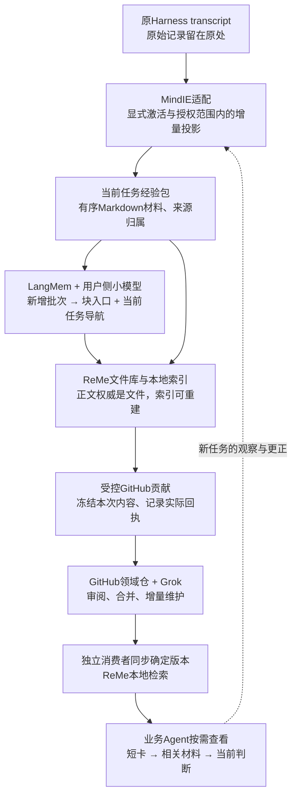

# Transcript 到共享经验：宏观架构与组件组合

日期：2026-10-04，验收更新至北京时间10月5日。core、Codex及公开内容迁移已合入，正式安装和旧阶段证据保持原版本。用户后续授权的新合成目录已完成正常Stop→自动PR39→现有Grok自然审查合入→独立HTTPS消费，精确main为 `9b7966f`；该[Stage5回执](knowledge-review-2026-10-04/evidence/stage5/review.md)只覆盖一个合成样本及首次激活之后的合格公开正文。下文区分目标职责、历史阶段和当前实际结果。

**当前组合：ReMe 管Markdown材料的分块、文件图与派生检索，LangMem 管小模型增量索引，Git/GitHub 与现有 Grok 管共享和维护，MindIE 保留宿主接入、规范经验包与事务边界、单一队列及操作回执。** Gitleaks 继续承担既有凭据检测。通过裁剪和定点改造接成一个模块，不同时运行几套完整记忆系统。

## 1. 核心任务到底是什么

把用户已经付出成本产生的任务经历，持续转化为其他任务可发现、可阅读、可判断适用性的参考材料。完整过程是：

> **有范围地收集 → 保留可分享经历 → 廉价建立检索入口 → GitHub贡献与维护 → 其他任务按需复用 → 新观察继续补充。**

它不是个人偏好记忆器，不是要求模型自动认证每条结论的知识工程，也不是只生成一个会话摘要。成功、失败、错误猜测、纠正和未完成都可以留在材料中；加工和分发不能把它们改成另一种含义。

从历史讨论继承的核心约束保持不变：

- 不建设中心算力、原始会话存储或在线检索服务。参与者本机处理，GitHub保存共享成果。
- 原始transcript由Harness保管；不另外归档所有人的完整原始记录。
- 小模型只承担足够有用的索引整理，不默认强模型重写全部正文、反复核验或多角色反思。
- 本地保留当前有效材料和必要操作状态，不保留每轮全文副本。
- 安装级授权只做一次，session显式启用；历史贡献显式选择；普通工作不增加强制收尾。
- 经验是参考；必要处理失败与外部结果未知必须可见。

## 2. 为什么选择组合，而不是继续扩大自研核心

三组独立调研检查了九个项目的当前官方实现：LangMem、ReMe、Basic Memory、Mastra、claude-mem、ACE、Mem0、Hindsight、OpenMemory。它们分别成熟于摘要、私人记忆、文件检索、观察队列或推理；没有一个所查版本现成覆盖我们的多人贡献及GitHub闭环。

因此采用**成块替换职责**的方式：

| 选定部分 | 承担的完整职责 | 必须裁剪/改造的范围 |
| --- | --- | --- |
| **ReMe文件/检索组件** | 已获准Markdown材料的分块、文件图、BM25、派生缓存持久化与搜索 | 进程内使用固定上游组件；不启Application默认配置、服务、jobs、watcher、模型、embedding、tags或原始transcript副本；定点覆盖上游吞掉的读写错误 |
| **LangMem函数式摘要** | 新增完整块与已有短导航的一次组织、块入口及导航更新 | 当前通过Codex summary-worker协议调用小模型；完整批次不被静默裁剪；调用、usage、失败原因和未知结果有持久回执；不复读已索引块 |
| **Git/GitHub** | 公开文件版本、贡献PR、内容变更、客户端增量同步 | 受控暂存与分支；处理未知写结果；当前公开版本为跨用户权威 |
| **现有Grok Bot** | 公开贡献审查、合并、基于新材料的关联与修正 | 以当前head/新增修订为单位；不为每个用户重新读整份原始历史，不把经验审查变成技术认证 |
| **Gitleaks及已有规则** | 已知凭据/路径等检测与脱敏 | 保留跨材料边界所需上下文，统一脱敏结果语言；不宣称可识别全部私有业务文字 |
| **MindIE适配与经验包边界** | 各Harness身份与范围、增量投影、规范包/哈希、候选文件与已提交指针、单一队列、成本/发布回执 | 权威正文为Markdown；SQLite保留小元数据和必要回执，不镜像正文或实现第二套检索算法 |

已合入实现已删除旧正文数据库路径、自有FTS检索、全文重写organizer及其兼容恢复接口。ReMe实际拥有chunk、FileGraph、BM25和派生缓存；LangMem实际承担完整新增批次的摘要算法。运行时不自动导入旧状态，也不并行运行旧算法。

规范任务包、Git完整性绑定、文件候选提交与清理仍是MindIE自有边界代码，不能称为ReMe原生事务实现。它只解决现有授权队列与普通Markdown/Git之间的提交语义；每份当前材料保留一套权威Markdown文件，ReMe派生chunk/index缓存可能包含材料文本，可独立重建，并不表示磁盘只有一份字节副本。本地不另外复制原始transcript，也不为每个revision保留整份正文档案。已修复的边界包括当前manifest丢失被当成新任务、清理路径跟随符号链接，以及清理异常覆盖已提交主错误。

## 3. 全流程：一套本地模块，两类客户端角色

贡献者和消费者是同一个模块的两种使用方式，不是两个服务。消费者无需贡献、不用上传历史，也能在本机查询公共经验。关闭贡献不关闭公共同步和查询，但禁止当前任务的采集、整理和上传。

ReMe以进程内文件/检索能力接入；LangMem是同一本地worker调用的摘要函数。不同时启动ReMe自动演化服务、LangGraph后台执行器和MindIE另一套模型调度。模型仍复用用户已有Harness通道，不新增维护者托管模型平台。

## 4. 数据单位：整任务、材料块、索引各司其职

整session、分块、主题经验不是三选一。

| 层 | 单位 | 用途 |
| --- | --- | --- |
| 来源与完整性 | 获准任务/session范围 | 知道哪些材料属于同一经历，哪些范围未获准、处理失败或未完成 |
| 增量处理 | 按消息/结构边界形成的稳定材料块 | 已完成的材料不反复读写；长任务可以持续追加，不受单次模型窗口限制 |
| 发布与共享 | **一个任务的经验包** | 由任务入口和有序Markdown材料组成，可持续更新；一次有意义的贡献批次可以包含多个包 |
| 查找与导航 | 各块检索入口＋当前任务导航 | 找到中段问题，也能理解整个任务当前的更正和结果；不是唯一内容存档 |

经验包以 `tasks/<task_id>/index.md` 和有序 `blocks/<block_id>.md` 发布。`mindie-material-task/1` manifest嵌入`mindie-entry/3`头部，绑定每块文件哈希、公开来源范围、标题、摘要与索引状态；块使用`mindie-material-block/1`。当前块正文上限为16 KiB并按UTF-8边界无损拆分。包的`status`表示索引处理阶段，不表示业务结论已被验证；失败和不确定性仍由原材料和导航表达。

块身份绑定不可变文件。维护者或Bot确需脱敏、修正某块正文时，应生成新的block身份和文件，更新manifest的有序块描述、文件哈希、material_digest、entry revision及对应导航，并从当前包移除被替换的旧块。不能在原block身份下改写字节，或只改哈希就把不完整修订标为完成；无法形成完整有效包时保留未合并状态和具体原因。这是既有格式合同，不要求模型重写正文或给普通PR增加另一轮处理。撤下通过删除整个`tasks/<task_id>/`包完成，包括index与全部块；不以`status: retired`或遗留孤立块代替删除，原因留在Git/PR记录中。

这是普通文件组织和Git完整性校验，不新增分布式存储服务。公开仓库已有20条经验的一次离线重新打包已通过[PR37](https://github.com/mindie-agent/knowledge-vllm-ascend/pull/37)合入 `5273638c81f55cc8b1423d887b6859d51d6f3621`，源head `55ac4704d77a7423a06d8cda8d8403b42ac5af4a`：保留原正文110,289字节、标题、摘要、conditions和entry_id，形成20包/22块，无新模型调用；反馈仍指向原revision。固定validator `929bdcb918f2207aea38b02a14bd8e6219fabac4` 的候选检查和[合并后自动工作流](https://github.com/mindie-agent/knowledge-vllm-ascend/actions/runs/37215772292)均实际验证20 entries、1 feedback、246,051 bytes。该操作不成为运行时兼容层，也不自动导入私有材料或更旧Git历史。

正文保留获准且脱敏的公开经历，默认复用业务Agent已经写出的材料。不要为了填满“根因、步骤、验证”模板而再调用模型补造。相同技术问题可能跨多个包，先以搜索和来源关联发现；不要求入库前全部归并成唯一权威主题。

每块索引长期指向其当前材料，顶层running summary只负责导航。即使顶层摘要遗忘早期细节，早期材料和入口仍能检索。读取旧失败时同时可看到当前任务导航及后续更正，不能只拿某轮早期总结当最终结论。

“保存以前发生的失败过程”与“保存每次编辑的旧正文快照”不同。前者属于当前经验内容，应该可以保留；后者没有用户价值，不建立。

## 5. 长任务的默认处理方式现在定下来

**默认采用完整新增批次的一次小模型索引，持续更新导航；不采用首尾采样作为唯一整理入口，也不追加最终全文重写。**

1. 采集仅增加尚未处理的获准公开材料。确定的重复事件、继承包装和宿主可识别的空进度可机械去重；不凭自由文本关键词删除可能含有用信息的过程。
2. 累积到合适批次后，小模型读取本批完整材料和很短的既有导航，在同一次处理生成可用于检索的入口并更新任务导航。
3. 已完成块不再送模型；任务继续则处理新增块。任务停止时只处理尚未整理的尾部，不再对全任务做一次“最终总结”。
4. 摘要错误可以重新生成，正文仍在；用户更正和新失败进入后续增量并更新导航。不要为保住某个摘要不断重写来源。
5. 采集、模型处理和GitHub发送有各自节奏：不是每条消息一次模型，也不是每次Stop一个PR。Stop不代表任务永久结束。

这项取舍解决首尾策略永远看不到中段的重要问题，但不声称恒定费用。设新增公开材料总量为N、处理批数为k、短导航和固定提示开销为S，正常摘要输入接近 `N + k×S`；它避免每轮发送累计全文的重复，仍有初次阅读成本。无需强模型提炼可信结论，不把“读新材料生成入口”扩大成多轮研究。

短任务自然退化为一次处理。超长任务按同一规则持续工作，不需要另一套历史导入整理器。后续若证明某类结构化抽样能进一步省钱且不损害复用，可替换输入优化策略，不改变经验包、文件权威和共享闭环。

模型不可用或预算用完，材料可以先保存，索引和贡献明确待完成；不能用摘录冒充已经整理。错误恢复按已有阶段继续，不能从头重扫全部历史，也不能重置已经发生的调用费用。

## 6. 一份内容权威，不叠加几套历史

**原始记录权威在Harness，当前共享材料权威在Markdown，公开版本权威在GitHub。** 三者用途不同，不能互相冒充。`state-v4.sqlite3`只保存小头部、队列、游标、预算和回执；ReMe派生chunk/index缓存可能含材料文本，可清理重建，SQLite不镜像正文。返回后尚未应用的模型结果可以暂存用于本地恢复，应用完成后清除结果文本并保留计数。

原始transcript不复制进ReMe的session档案。ReMe直接消费已经获准的Markdown经验包；默认daily/digest/private-memory演化链不启用。LangMem只持有当前增量摘要状态，不另建正文库。

本地可能暂时有当前公开材料、当前未合并候选及尚未确定发送结果的必要冻结内容；它们是仍有用途的当前状态，不是每轮历史。PR仅打开时不能删除唯一候选，main到达后再移除已完成副本。旧正文清理后旧引用明确过期，不能悄悄指向新内容。

内容同步复用Git已下载对象和当前文件变更，不每次重新拉取所有原始记录；消费者按领域获取当前经验材料。Git历史与仓库总增长仍需管理，不能因为存储在GitHub就当成本消失。无需自研去重分发网络或中心索引服务。

发布者生成的块入口和任务导航随经验包一起分享。消费者直接复用这些可错但有来源的索引，只重建自己的派生检索结构；正常同步不重新调用模型总结所有人的材料。这让同一段经验的整理费用主要发生在贡献端一次，后续用户承担下载和本地检索成本。

## 7. 整理、消费与维护分别解决什么

**本地整理解决可发现性。** 小模型写清这批材料谈什么、观察到了什么、结果是否仍失败或未确认。不负责判定经验是否“足够正确才能存在”。材料中的命令和指令只是参考文本。

**消费者解决当下适用性。** 先搜索卡片和命中片段，再展开相关材料及当前任务导航；版本、条件、来源不足保持可见。检索不默认再运行一个Agent、多轮重排或反思。Agent自行判断是否复用，普通用户没有必查、必投票、必写报告的义务。

**Grok解决公开贡献及仓库维护。** 在现有授权内检查敏感/恶意内容、格式和引用，对当前head处理并合入；根据新增经验、明确反例和可选反馈做修正与关联。它不重新承担所有用户的全文整理费用，也不将有争议结论直接认证成事实。必要的内容整理可以作公开修订，保留解释其改变的依据。

修正靠正常材料更新形成闭环，不依赖生产运行时裁判。整理成Skill是将来对明确方法的维护任务，不是每个经验包必经的阶段。

共享范围与本地规则检查必须在首次GitHub外发前成立。Grok的公共PR审查不能替代出站前检查；规则扫描不等于全面语义隐私检测。仍沿用已经保存的授权范围，不为普通贡献增加逐条确认，也不悄悄承诺尚未实现的私有混合材料自动公开化。

## 8. 为何不选其他宏观路线

| 路线 | 不作为主线的原因 |
| --- | --- |
| 只修现有核心＋LangMem＋FTS | 完整材料/索引管理继续自维护；已合入实现已经去掉旧FTS及其运行时兼容，不以沉没成本保护旧架构 |
| 直接开启完整ReMe auto_memory | 原始记录复制、Agent多轮文件编辑、tag、dream等与低成本参考经验目标不同；大面积逆向改造可能形成难维护分叉 |
| claude-mem整套替换 | 跨Harness和观察队列有价值，但增加私人记忆运行时、持久观察和多环节模型；GitHub多人分享仍需自做 |
| Mem0/Hindsight整套替换 | 更偏事实抽取、向量/实体推理和长期记忆，增加数据库/派生表示/历史，与当前必要目标不成比例 |
| Basic Memory替ReMe | 文件检索是合理备选，但有额外写入同步模型、依赖及许可边界；不在第一轮同时引入两个文件知识系统 |
| ACE为默认整理流程 | 多角色反思、playbook全量上下文及评分目标超出需求；局部修订思想可直接借给Grok维护 |

框架选择依据当前固定源码，而非旧介绍。当前OpenMemory主线已是会话迁移CLI；旧MCP已归档。claude-mem当前已支持多Harness且是Apache-2.0，不能用过时印象排除它。详细证据见[选型报告](knowledge-framework-selection-2026-10-04.md)。

## 9. 已落地的参数与尚待验证的范围

| 当前实现已落地 | 依据与剩余边界 |
| --- | --- |
| 任务经验包＋稳定Markdown块＋当前短导航 | 完整新增材料无损拆分；正文不由模型改写；追加及头部更新不重读以前正文 |
| 每批完整输入，一次小模型索引 | 最多8块、序列化prompt 64 KiB；限制作用于批次，不截断整任务，后续块继续排队 |
| ReMe固定组件＋LangMem函数式摘要 | ReMe `4c54c2b650038eff2a5d0d77aaa61b3e836f1b18`，LangMem `0.0.30`；上游ReMe导入边界仍要求AgentScope依赖，但不实例化其模型/Agent |
| 实际小模型调用与阶段回执 | 已用 `gpt-5.6-luna`、low完成选定材料；保留已知usage和失败调用，未知结果不自动重放 |
| 文件正文＋SQLite小状态＋可重建缓存 | current指针与已提交元数据绑定；commit后的清理失败和主操作结果分别可见 |
| Codex summary-worker协议 | Kimi/Claude Code有生产parser兼容测试，其summary worker尚未迁移；不据此宣称三个Harness完整可用 |

这些参数是当前实现配置，不是所有未来任务的业务门槛。后续调整摘要长度、预算、依赖与检索策略时应复用已有正文、当前包和有效测量，只验证变更影响。GitHub/Grok事件链和各平台原生入口仍须按实际部署另行验收。

## 10. 已有验收证据与完成边界

宏观验收仍看五个结果：收集完整且范围正确、索引成本可承担、相关材料可找到、分享闭环成立、失败后可维护。当前证据来自knowledge仓库的[固定匿名验收记录](https://github.com/mindie-agent/knowledge/blob/0fa011701f4d73f40709df56c969cc3492eb8fab/tests/fixtures/k3-system-acceptance-2026-10-04.json)；仅提交计数和检索结果，真实transcript留在原本机。初始研究与后续实施的范围、版本和证据哈希在[分阶段清单](knowledge-review-2026-10-04/evidence/manifest.json)中分别记录。

| 结果 | 已验证 | 尚未据此证明 |
| --- | --- | --- |
| Stage5公开原生闭环 | 后续明确授权的新合成目录经正常Stop、一次索引、自动PR39、Grok自然处理合入；独立HTTPS消费者完整375字节正文/哈希匹配，2→4更正及硬件未知保留 | 私有业务公开授权、整个启动会话、普遍检索质量或真实硬件；旧阶段表项仍按其原始范围理解 |
| 收集与保留 | 四个显式选定的真实K3任务，经原生parser读取全部快照；最终81块全部建立索引，材料保持失败、更正和未完成表述 | 任意私有业务语义都能由规则自动识别、所有未来Harness格式均已适配 |
| 索引与费用可见 | Luna共35次原生worker调用，包含一次3个源块却返回4个索引的明确失败及一次显式重试；保留658,424 input / 33,219 output tokens，未知调用为0 | 提供商内部请求次数、恒定价格、货币费用推断，或所有摘要均准确的认证 |
| 本地可发现性 | 12个技术查询均找到目标任务并返回材料片段；ReMe为实际固定上游组件 | 通用召回基准、任意自然语言问法或大规模排名质量 |
| 独立消费者 | 真实材料阶段本地Git取得4包并完成12次目标查询；最终公共GitHub HTTPS阶段同步精确main的20包，3个预定query/explain核对完整正文哈希；消费者模型调用为0，重复同步unchanged | 公开原生Stop与Grok事件审查合入闭环，以及所有检索问法的质量 |
| 原生入口与消费 | 独立profile的合成任务经正常Stop、一次Luna索引、本地Git发布及既有updater入口同步后，另一原生任务query/explain成功；消费者采集/索引/outbox均为0 | OS定时器首次启动、公开GitHub传输、正式贡献配置及真实硬件验收 |
| 公开内容与Grok配置 | 20条既有公开经验无损重打包并合入main；合并后新格式工作流通过；三个既有routine保存的新pin/schema已回读，Bot隔离validator通过 | 新PR事件已交付、Bot自动审查合并、完整Bot runtime安装或新的私有材料获准公开 |
| 正式安装与同步 | Codex最终merge tree及依赖准确安装；正常宿主界面信任Stop；原有scheduler一次运行同步20条，插件up_to_date | 无人工介入的首次升级、完整独立调度日志、长期SLA或新的原生公开贡献 |
| 失败与维护 | 无模型正文改写；已返回结果的本地扫描/应用失败不重复付费，未知调用不自动重放；损坏索引显式失败并可单独重建 | 所有操作系统组合、长期资源增长或所有外部服务故障均已验收 |

那次3→4重复索引失败曾产生已知usage，计入35次总数；没有当成未执行自动重试。原生输出schema现约束精确数组长度，仍保留block身份/顺序校验，诊断区分`index-validation`与native执行阶段。显式修复重试后81块完成，但失败证据与费用不抹除。

**材料→小模型索引→ReMe检索→独立本地Git消费者已有真实数据证据；正常原生Stop到本地Git独立消费另有纯合成验收。** 后者实际版本为Codex `351e9f8` / core `d07934b`，一次索引耗时12,857 ms、8,835 input / 232 output tokens，和前述35次历史调用分开记账。首次launcher身份继承错误、首次消费者尚未同步的空结果，以及发现并修复的updater错误退出码均保留在[匿名原生回执](knowledge-review-2026-10-04/evidence/native-local-acceptance.json)。同步复用了既有`auto_update.py check`，只验证一次正常入口调用，没有安装OS定时器。

正式部署及公共消费的后续结果见[安装与调度回执](knowledge-review-2026-10-04/evidence/formal-deployment.json)、[公共消费者回执](knowledge-review-2026-10-04/evidence/public-github-consumer.json)和[Grok配置回读](knowledge-review-2026-10-04/evidence/grok-format-cutover.json)。旧updater失效import的失败保留，一次显式恢复完成安装；正常Hook信任与旧scheduler运行分别记账。Grok完整runtime仍有缺失依赖，保存routine与校验通过仅覆盖配置/validator。截至该Stage4记录时，正式公开贡献范围尚未选择，公开原生事件链未验收；后续授权的新合成目录及Stage5成功另见上文，不倒填旧阶段事实。离线转换只复用已有摘要，不增加模型质量或技术事实认证。

## 配套材料

- [九个框架的系统选型、组合取舍与一手来源](knowledge-framework-selection-2026-10-04.md)
- [最初实现review与可复现问题](knowledge-experience-review-2026-10-04.md)：保留为本轮架构变化的来源，不代表当前实现仍有全部旧问题。
- [详细流程与行为合同](knowledge-experience-design-2026-10-04.md)：实施参考；与本文方向冲突时以本文为准。
- [分层验收与迭代方法](knowledge-experience-evaluation-2026-10-04.md)
- [LangMem隔离接口试接](knowledge-review-2026-10-04/evidence/organizer/langmem-spike/README.md)
- [实施阶段证据与九原则审查](knowledge-review-2026-10-04/evidence/implementation-review.md)
